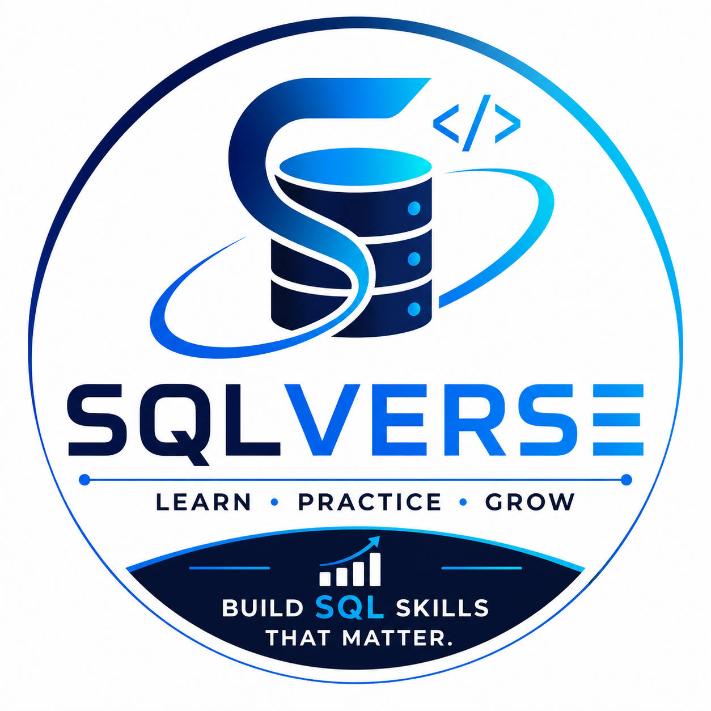
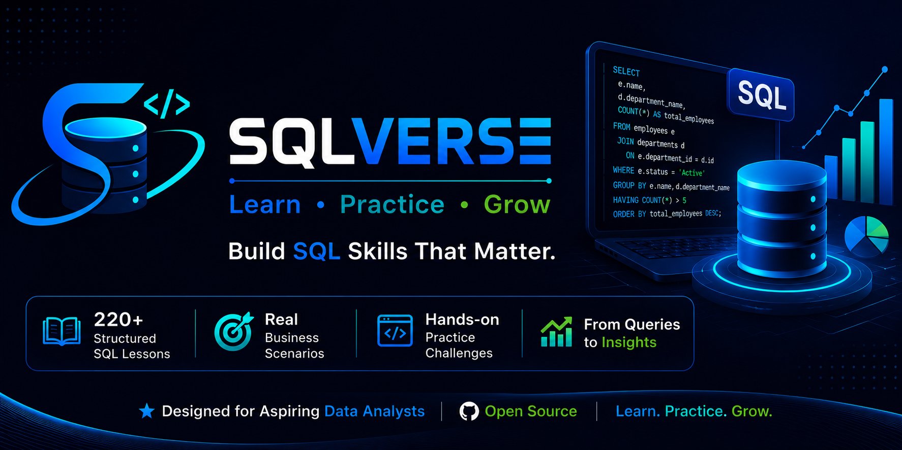

<p align="center">
  
</p>

<h1 align="center">SQLVerse</h1>

<p align="center">
  <strong>Learn • Practice • Grow</strong>
</p>

<p align="center">
  Build SQL Skills That Matter.
</p>

<p align="center">
  
  
  
  
  
</p>

<p align="center">
  
</p>

<br/>

## 📖 Introduction

**SQLVerse** is a structured SQL learning repository built to help learners master SQL through real business scenarios, not syntax memorization.

This is not just a collection of queries. It is a complete learning ecosystem, where every lesson is designed around a single SQL concept and reinforced through explanation, data, practice, and visual teaching material.

Each lesson combines:

- 📝 A clear, focused concept explanation
- 🏢 A realistic business scenario
- 🗄️ A real, runnable database schema
- 💻 A complete SQL solution
- 🎞️ A professionally designed presentation
- ✍️ Hands-on practice questions

The goal is simple: help learners build SQL skills that are directly useful in Data Analyst, Business Analyst, MIS Analyst, Reporting Analyst, and Data Science roles.

<br/>

## ✨ Why SQLVerse?

| | |
|---|---|
| 🎯 **Concept-First Learning** | Every lesson teaches exactly one SQL concept, deeply and clearly |
| 🏢 **Business-Oriented Examples** | Scenarios modeled on real workplace data problems |
| 🗄️ **Real Database Schemas** | Practice on realistic, runnable datasets — not toy tables |
| 🎞️ **Visual Presentations** | Every lesson includes a professionally designed PPT |
| ✍️ **Practice-Driven** | Hands-on exercises to reinforce every concept |
| 📈 **Structured Progression** | A clear path from beginner to advanced SQL |
| 💼 **Interview Ready** | Concepts framed the way they are asked in real interviews |
| 🧩 **Modular Design** | Learn at your own pace, lesson by lesson |

<br/>

## 🎓 Who Is This Repository For?

- SQL beginners starting from zero
- University students studying databases
- Job seekers preparing for Data/Business Analyst roles
- Working Data Analysts and Business Analysts
- MIS professionals
- Excel users transitioning into SQL
- Self-learners who prefer structured, practical content
- Interview candidates preparing for SQL rounds

<br/>

## 🧭 Learning Path

```
Choose Lesson
      ↓
  Read README
      ↓
Study Database Schema
      ↓
   Write SQL
      ↓
 Compare Solution
      ↓
Review Presentation
      ↓
    Practice
```

SQLVerse follows a simple philosophy: **Learn → Understand → Practice → Solve → Apply → Repeat.**

Instead of overwhelming learners with long tutorials, each lesson isolates one concept and builds knowledge gradually, lesson by lesson.

<br/>

## 🗂️ Repository Structure

```
SQLVerse/
│
├── assets/
│   ├── logo.png
│   └── Banner.png
│
├── lessons/
│   ├── SQL-001/
│   │   ├── schema.sql
│   │   ├── solution.sql
│   │   └── SQL-001.pptx
│   │
│   ├── SQL-002/
│   │   ├── schema.sql
│   │   ├── solution.sql
│   │   └── SQL-002.pptx
│   │
│   ├── SQL-003/
│   │   └── ...
│   │
│   └── ...
│
├── LICENSE
└── README.md
```

<br/>

## 📦 What Every Lesson Includes

| Component | Purpose |
|---|---|
| `schema.sql` | Database schema for the lesson |
| `solution.sql` | Complete, verified SQL solution |
| `SQL-XXX.pptx` | Visual lesson presentation |
| Practice Questions | Hands-on exercises to build skill |

<br/>

## 📚 Topics Covered

<details>
<summary><strong>Click to expand full topic checklist</strong></summary>

<br/>

- [x] SELECT
- [x] WHERE
- [x] ORDER BY
- [x] GROUP BY
- [x] HAVING
- [x] JOIN (INNER, LEFT, RIGHT, FULL)
- [x] UNION / UNION ALL
- [x] Subqueries
- [x] CTEs (Common Table Expressions)
- [x] Views
- [x] Indexes
- [x] Window Functions
- [x] CASE Statements
- [x] Built-in Functions
- [x] Aggregate Functions
- [x] Date Functions
- [x] String Functions
- [x] Constraints
- [x] Normalization
- [x] Transactions
- [x] Triggers
- [x] Stored Procedures *(where applicable)*

</details>

<br/>

## 📊 Repository Statistics

| Metric | Value |
|---|---|
| 📘 SQL Lessons | 220+ |
| 🏢 Business Scenarios | 220+ |
| 🎞️ Presentation Slides | 220+ |
| ✍️ Practice Questions | 500+ |
| 💻 Real SQL Examples | 220+ |
| 🗄️ Database Engine | SQLite Compatible |

<br/>

## 🚀 How To Use

1. **Clone the repository**
   ```bash
   git clone https://github.com/rafijurrahman/SQLVerse.git
   ```
2. **Navigate to a lesson folder**
   ```bash
   cd SQLVerse/lessons/SQL-001
   ```
3. **Review the lesson presentation** (`.pptx`) to understand the concept and business scenario.
4. **Load `schema.sql`** into your SQLite environment.
5. **Write your own SQL query** based on the practice questions.
6. **Compare your answer** with `solution.sql`.
7. **Move to the next lesson** and repeat.

<br/>

## 🤝 Contribution

Contributions are welcome and appreciated. You can help by:

- Suggesting new lesson topics
- Improving existing explanations or schemas
- Reporting errors in SQL solutions
- Adding practice questions
- Improving documentation

To contribute:

1. Fork the repository
2. Create a new branch (`git checkout -b feature/lesson-improvement`)
3. Commit your changes
4. Open a Pull Request

<br/>

## 🛣️ Roadmap

- [ ] MySQL compatible examples
- [ ] PostgreSQL compatible examples
- [ ] SQL Server compatible examples
- [ ] Oracle compatible examples
- [ ] Dedicated interview problem sets
- [ ] Mini projects using combined concepts
- [ ] Real-world case studies
- [ ] Dashboard-ready datasets

<br/>

## 🔗 Connect With Me

<p align="center">
  <a href="https://www.linkedin.com/in/mdrafijur">
    
  </a>
  <a href="https://github.com/rafijurrahman">
    
  </a>
</p>

<br/>

## ⭐ Support

If SQLVerse has helped you learn SQL, consider starring the repository. It helps others discover this resource and supports continued development.

<br/>

## 📄 License

This project is licensed under the **MIT License**. See the [LICENSE](LICENSE) file for details.

<br/>

---

<p align="center">
  Built with dedication for SQL learners around the world.
</p>
